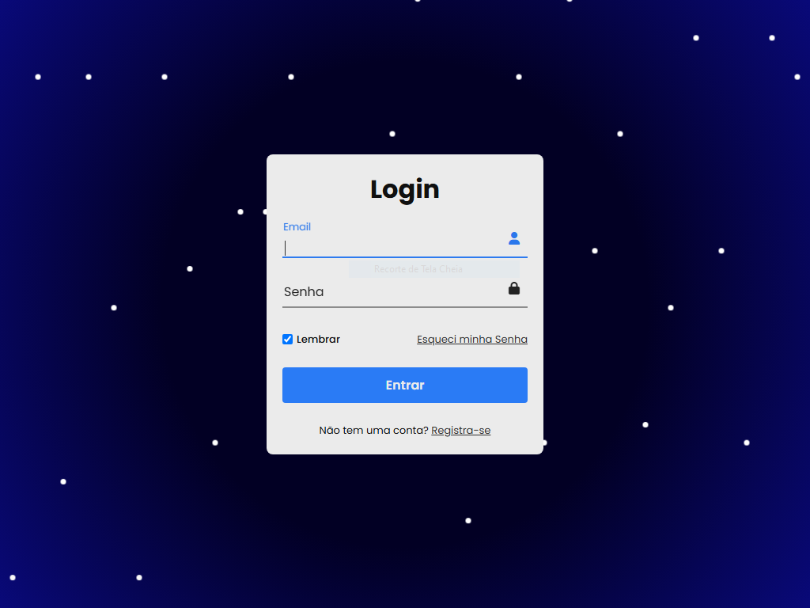

# Página de Login com Fundo Animado

Este projeto é uma interface de **Login Responsiva** com **efeitos animados no fundo** usando HTML, CSS e JavaScript. Foi pensado com foco em estética, usabilidade e interatividade.

## 🚀 Tecnologias Utilizadas

- **HTML5** — estrutura semântica
- **CSS3** — layout responsivo, animações e transições
- **JavaScript** — geração dinâmica do fundo animado
- **Font Awesome** — ícones no formulário

## 🎨 Funcionalidades

- Formulário com campos de Email e Senha
- Ícones flutuantes que mudam de cor ao interagir
- Labels animadas que sobem ao digitar
- Validação nativa com `required`
- Responsivo para dispositivos móveis
- Fundo animado com elementos circulares

## 📂 Estrutura de Pastas

```
/src
 ├── /css
 │    └── style.css
 ├── /javascript
 │    └── background.js
index.html
```

## 🖼️ Captura de Tela

```
📌 Exemplo:

```

## 🛠️ Como usar

1. Clone este repositório:
   ```bash
   git clone https://github.com/Carlos728293/login-animado.git
   ```

2. Abra o arquivo `index.html` no navegador.

3. Acesse o link: https://login-animado-mu.vercel.app/

> Nenhuma instalação adicional é necessária. É um projeto 100% front-end.

## 📱 Responsividade

O layout se adapta a telas menores com media queries e fontes flexíveis. Ideal para testes em:

- Smartphones
- Tablets
- Notebooks

## 💡 Melhorias Futuras

- Integração com autenticação real (Firebase, API REST, etc)
- Tema escuro (Dark Mode)
- Feedback de erro para login inválido
- Animações ao submeter

## 📄 Licença

Este projeto está sob a licença MIT. Sinta-se livre para usá-lo, modificar e contribuir.

---

### 👨‍💻 Desenvolvido por [Carlos Eduardo]